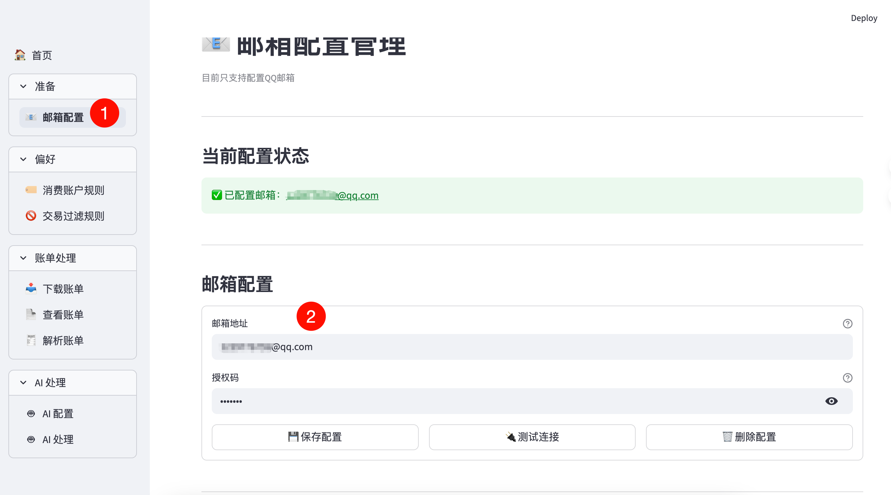
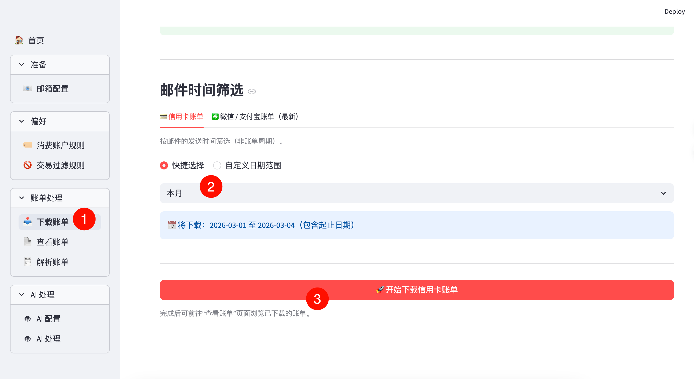
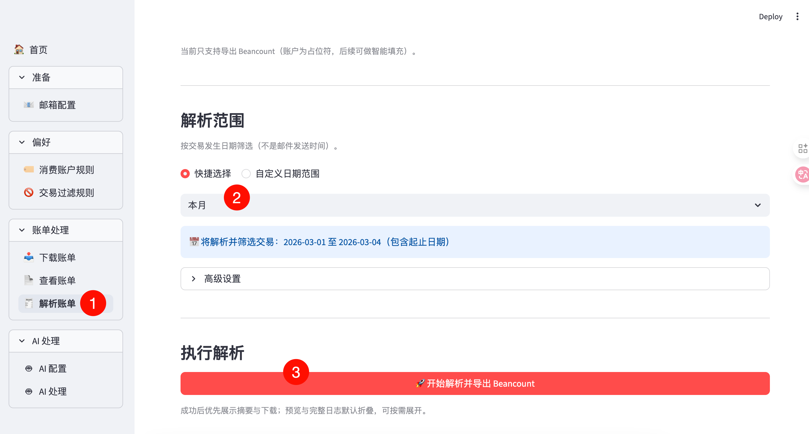
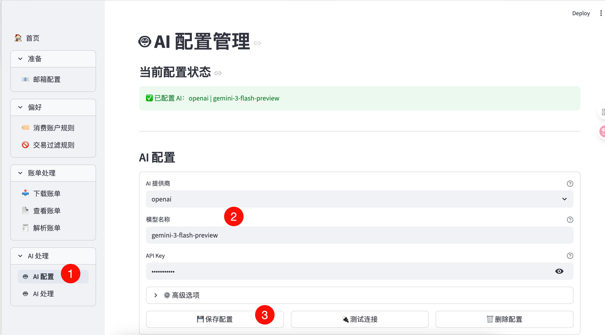
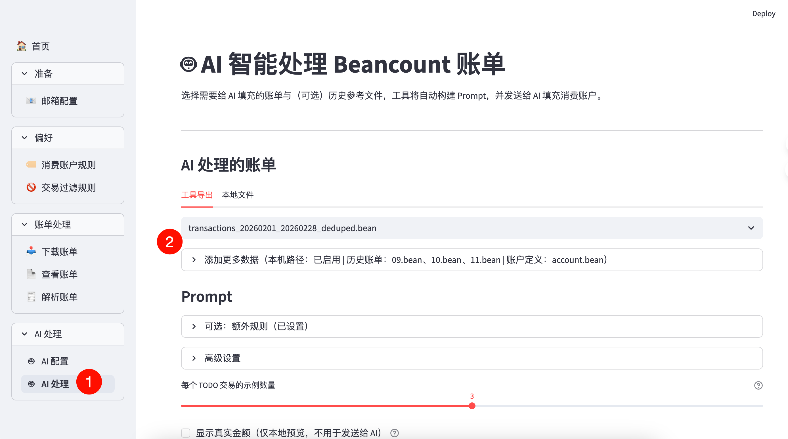
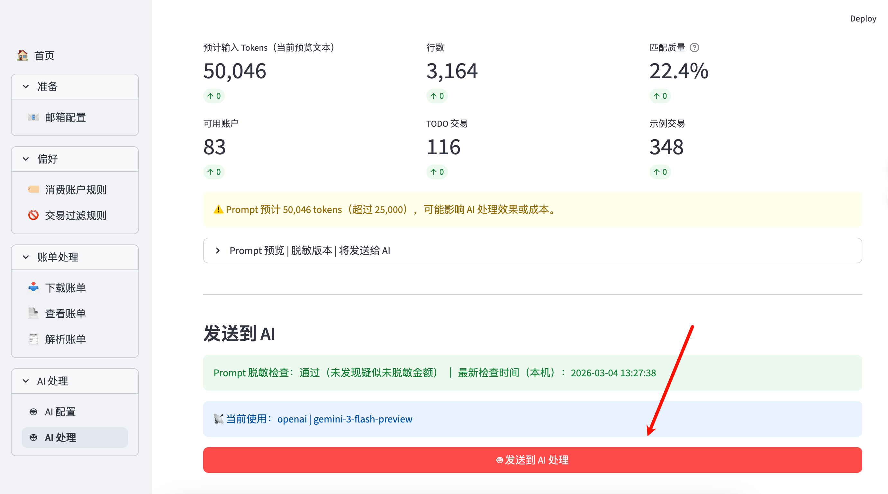

# FinanceMailParser - 金融账单邮件解析工具

## 用户故事
小李决定开始记账，目标很朴素：知道自己每个月到底花了多少、花在什么地方。他不追求“全量流水都记”，只想稳定记录支出；工资入账、信用卡还款、转入转出这些他都不想逐笔管。

第一个月他还能硬着头皮手动做：翻邮箱找各家账单邮件，下载附件或打开网页，把日期、商户、金额一笔笔抄到自己的账本里。很快他发现三件事让人崩溃：来源太多（几张信用卡+支付宝+微信）、格式不统一、还经常遇到重复邮件/重复账单导致重记；而且分类越来越难坚持——同样的商户下个月又换个类别，复盘时根本看不出规律。

后来他用 FinanceMailParser，把“收集→整理→输出”变成固定流程：在 UI 里配置好邮箱与规则后，每个月一键把账单邮件下载落盘到本地缓存目录，自动解析成统一的交易数据，做去重，并按他的规则把“还款/转入/入账”等非支出交易过滤掉。这样他至少能稳定得到一份“干净的支出清单”，不再被收集和整理拖垮。

当他想“记得更细”时，有两条路可以走，而且各有取舍。

第一条是系统内的规则化能力：比如用关键词/范围过滤、商户关键词映射、固定的分类规则，把一部分常见交易稳定归类。这条路的优点是可控、可解释、长期稳定；缺点是前期要花时间把规则慢慢补齐，遇到新商户/新场景还是得手动加规则。

第二条是用 AI 做辅助：在需要的时候把交易描述交给模型，让它根据上下文去补全更细的账户/类别。它的优点是覆盖面广、对“新商户/新描述”更友好，缺点是可能误判。

他之所以最终把账本落在 Beancount 上，是因为 Beancount 对“结构化、可审计、可校验”的流水非常友好：同一套分类/账户体系可以长期复用，文本化的账本便于版本管理与回溯，且能做一致性校验；这对他这种“只记支出但想长期复盘”的目标很匹配。换句话说，FinanceMailParser 负责把账单变成高质量、结构一致的输入；Beancount 负责把输入变成长期可维护的账本体系。

当然，这条路也有现实的缺点需要提前接受：不是任何时期都能“一键统一处理”：比如银行/平台在某段时间改了账单模板、某些账单缺字段、某些交易描述极其模糊、或者你临时出现一类新的消费场景（旅行/装修/大额分期等）。还有就是人工需要最后核验一遍，没有问题才落到beancount。所以这些都是需要时间来校验和手动处理一些不能统一处理的账单。

也就是说，自动化能把日常成本压到很低，但在“变更期/异常期”会出现一段集中投入：需要更新规则/解析适配，花更多时间人工核对这批数据，把体系重新拉回稳定状态。

## 门槛
使用过beancount，或者愿意从0配置beancount（其实也可以导出成别的记账软件使用的格式，比如csv导入钱迹，这部分暂未打算）

## 设计理念

1. 解析信用卡和微信支付宝账单，并记账，但是只记录支出，不覆盖收入
2. 工具用于降低记录压力，提供自动账单下载、解析、去重、导出 Beancount、AI填充支出账户功能
3. 整体接受“模糊的正确”，忽略极致的精准记账记录
4. 账单管理目前只支持beancount，也就是用beancount记录支出

- 解析范围：微信、支付宝，以及信用卡（建设、招商、光大、农业、工商）
- 下载来源：仅 QQ 邮箱账单；信用卡按日期范围筛选，微信/支付宝仅取最新一封

## 使用场景介绍
### 信用卡基础场景
1. 在 UI 的邮箱配置页保存 QQ 邮箱地址与授权码（敏感字段会加密写入 `config.yaml`）


2. 下载特定日期的信用卡账单（需要事先配置信用卡账单发送到邮箱）


3. 解析信用卡账单为beancount文件


4. 配置AI


5. 使用AI填充支出账户（最好提供历史账单和账户参考参考）



6. 校验通过，下载导出的beancount文件，使用vscode等文件编辑器核验need_review标签的账单

7. 手动处理完成，将beancount文件放入到自己的beancount项目里面，整个流程即可完成

## 使用说明

### 1) 环境准备

- Python `3.10+`
- 安装依赖（使用 uv）：

```bash
uv sync --all-extras --dev
```

### 2) 设置主密码（用于敏感配置加密）

```bash
export FINANCEMAILPARSER_MASTER_PASSWORD='your_master_password'
```

说明：
- 该变量用于加密/解密 `config.yaml` 中的敏感字段（如邮箱授权码、AI API Key）。
- 需要在启动应用前设置。
- `FINANCEMAILPARSER_MASTER_PASSWORD` 不会落盘；一旦丢失，将无法解密既有密文配置，需要重新录入并保存（这是预期的安全特性）。
- `config.yaml` 属于本地敏感配置文件，默认已在 `.gitignore` 中忽略，请不要提交到仓库。

### 3) 启动 Web 界面

```bash
uv run streamlit run ui/streamlit/app.py
```

### 4) 开发与自检（可选）

如果你在本地做开发或想快速确认环境/规则没问题，可以按需运行以下命令：

```bash
uv run pytest
uv run ruff check .
uv run ruff format .
uv run mypy .
uv run pre-commit run -a
```

## 技术说明

### 配置边界

- **用户输入配置**（可变、可能含敏感信息）：`config.yaml`
  - `email.qq.email`
  - `email.qq.auth_code`（加密）
  - `ai.provider/model/api_key`（`api_key` 加密）
  - `user_rules.*`
- **系统规则**：`business_rules.yaml`
- **路径与运行常量**：`src/financemailparser/shared/constants.py`

路径可通过环境变量覆盖：
- `FINANCEMAILPARSER_CONFIG_FILE`
- `FINANCEMAILPARSER_BUSINESS_RULES_FILE`
- `FINANCEMAILPARSER_EMAILS_DIR`
- `FINANCEMAILPARSER_BEANCOUNT_OUTPUT_DIR`
- `FINANCEMAILPARSER_MASK_MAP_DIR`
- `FINANCEMAILPARSER_TRANSACTIONS_CSV`

### 架构分层（目录结构与职责）

> 约定：本项目使用标准 `src layout`。可安装包名为 `financemailparser`，源码位于 `src/financemailparser/`。

```text
FinanceMailParser/
├── pyproject.toml
├── business_rules.yaml
├── config.yaml
├── ui/                              # 仓库级 UI（Streamlit 应用入口）
│   └── streamlit/
├── scripts/                         # 校验与开发脚本
├── tests/                           # 单元测试
│   └── shared/                      # shared 相关测试
├── emails/                          # 邮件落盘缓存（解析输入）
├── outputs/                         # 导出产物（输出）
└── src/financemailparser/           # 包源码（分层）
    ├── application/                 # 应用流程层（把功能串成流程）
    │   ├── billing/                 # 账单流程：下载/解析/导出
    │   ├── ai/                      # AI 流程：构建 Prompt / 调用 / 回写
    │   ├── settings/                # 配置流程：读取/保存/校验（给 UI 用）
    │   └── common/                  # 流程层公共代码
    ├── domain/                      # 核心模型与规则（尽量不做 IO）
    │   ├── models/                  # 领域模型
    │   └── services/                # 领域服务（纯逻辑能力）
    ├── infrastructure/              # 具体实现（IO/第三方/解析/落盘）
    │   ├── data_source/             # 邮箱等外部数据源（拉取/解析原始数据）
    │   ├── repositories/            # 本地仓储读写适配器（filesystem 等）
    │   ├── statement_parsers/       # 账单解析器
    │   │   ├── banks/               # 银行账单解析器
    │   │   └── digital_wallets/     # 支付宝/微信解析器
    │   ├── beancount/               # Beancount 写入/校验
    │   ├── exports/                 # 导出实现（CSV 等）
    │   ├── config/                  # 配置读取/加密
    │   └── ai/                      # AI provider/调用
    ├── integrations/                # 外部集成
    │   └── qianji/                  # 钱迹转换
    └── shared/                      # 跨层通用组件
```

目录职责说明（与上面目录树一一对应）：

仓库根目录（运行时文件与工程文件）：
- `pyproject.toml`：项目元信息与依赖定义（使用 uv 管理）；其中 `ui` extra 用于隔离前端依赖（`streamlit`）。
- `business_rules.yaml`：系统内置规则（例如账单邮件识别关键词、银行别名规则）。
- `config.yaml`：用户输入配置（可能包含加密字段，如邮箱授权码、AI API Key）。
- `ui/`：仓库级 UI（Streamlit 应用入口，不参与核心包 `.whl` 分发），只调用核心包暴露的流程。
- `emails/`：从邮箱下载/落盘的原始邮件内容（解析输入）。可视为缓存目录，必要时可清空重下。
- `outputs/`：导出产物（例如 `outputs/beancount/`）。
- `scripts/`：校验与开发脚本（pre-commit 会调用其中的校验脚本）。
- `tests/`：单元测试（使用 `pytest`）。

包目录（`src/financemailparser/`，按“分层依赖”组织）：
- `application/`：应用流程层（把“下载账单 / 解析导出 / AI 处理”等动作组织成可复用流程）。它会调用 `domain` 的纯逻辑、以及 `infrastructure` 的具体实现。
- `domain/`：核心模型与规则（尽量不做 IO，不依赖其他内部层），例如交易/来源枚举、以及“银行别名识别”这类纯逻辑。
  - `domain/models/`：领域模型（如 `Transaction`、`TransactionSource`）。
  - `domain/services/`：领域服务（纯逻辑能力，例如从邮件标题识别银行代码）。
- `infrastructure/`：具体实现（读写文件/调用第三方/解析 HTML/CSV/加解密等）。不依赖 `application`，也不关心 UI 入口在哪里。
  - `infrastructure/statement_parsers/`：账单解析器（银行/支付宝/微信），把输入文件解析为统一的 `Transaction`。
  - `infrastructure/data_source/`：数据源（当前为 QQ 邮箱）。
  - `infrastructure/repositories/`：仓储适配器（当前为本地 emails/ 目录的扫描与读取）。
  - `infrastructure/config/`：配置读取、校验、密钥加解密。
  - `infrastructure/ai/`：AI provider 与调用封装。
  - `infrastructure/beancount/`：Beancount 写入、解析与校验。
- `integrations/`：对外集成（例如 `qianji/` 钱迹相关转换）。
- `shared/`：跨层共享的通用组件（常量、脱敏、日期处理、轻量工具函数等），不依赖 `application/infrastructure/integrations`。

分层依赖方向：
- `ui/streamlit` → `application` → (`infrastructure` / `domain` / `shared`)
- UI 不直接依赖 `infrastructure`（UI 不碰“邮箱/解析/落盘”细节）
- `infrastructure` 不依赖 `application`（也不依赖仓库级 UI 入口）
- `domain` 不依赖其他内部层（只放纯逻辑）
- `shared` 不依赖 `application`、`infrastructure`、`integrations`

### 核心数据流程

1. **下载阶段**
   - `application/billing/download_credit_card.py`
   - `application/billing/download_digital.py`
   - 通过 `infrastructure/data_source/qq_email/parser.py` 获取邮件并落盘 `emails/`
2. **解析阶段**
   - `infrastructure/statement_parsers/parse.py::parse_statement_email()`
   - 按主题路由到银行/支付宝/微信解析器
3. **合并与规则处理**
   - `application/billing/parse_export.py`
   - `application/billing/transactions_postprocess.py`
4. **导出阶段**
   - `infrastructure/beancount/writer.py::transactions_to_beancount()`
   - 输出到 `outputs/beancount/`

### AI 处理核心组件

- `infrastructure/ai/config.py`：AI 配置管理
- `infrastructure/ai/service.py`：AI 调用与重试
- `application/ai/process_beancount.py`：AI 流程编排
- `shared/amount_masking.py`：金额可逆脱敏
- `infrastructure/beancount/validator.py`：结果对账校验

### 扩展：添加新银行解析器

1. 在 `financemailparser/infrastructure/statement_parsers/` 新增解析器文件（如 `bank_xxx.py`）
2. 实现统一接口 `parse_bank_xxx_statement(...) -> List[Transaction]`
3. 在 `infrastructure/statement_parsers/parse.py` 注册路由
4. 视需要更新 `business_rules.yaml` 关键词
